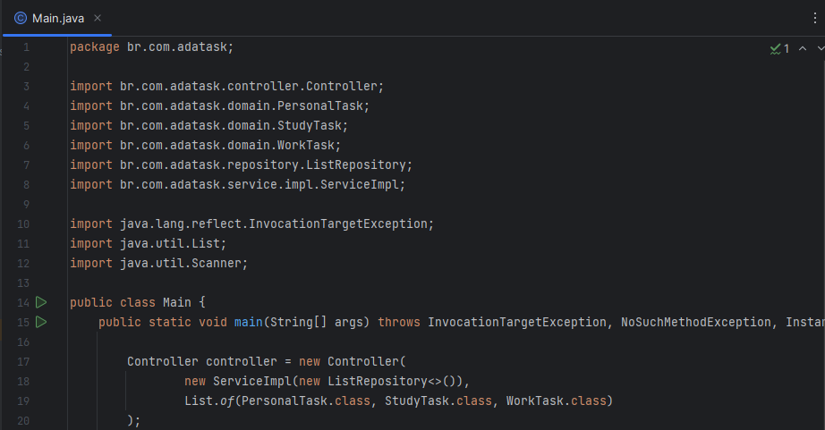

# TASKS

```mermaid
classDiagram
Identifiable <|-- BaseTask
BaseTask <|-- PersonalTask
BaseTask <|-- StudyTask
BaseTask <|-- WorkTask
BaseTask : -count: int
BaseTask : -id: Long
BaseTask : -title: String
BaseTask : -description: String
BaseTask : -deadline: String
BaseTask : -tag: Tag
BaseTask : +BaseTask(title, description, deadline)
BaseTask : +equals(obj): boolean
BaseTask : +toString(): String
PersonalTask : +PersonalTask(title, description, deadline)
PersonalTask : +tag: Tag.PERSONAL
StudyTask : +StudyTask(title, description, deadline)
StudyTask : +tag: Tag.STUDY
WorkTask : +WorkTask(title, description, deadline)
WorkTask : +tag: Tag.WORK
Identifiable : +getId(): U
```

## 🔍 Sobre

Aplicativo de Gerenciamento de Tarefas via Console

## 💻 Instruções para rodar

- Clonar repositório

```
git clone https://github.com/Akaori/tasks.git
```

- Abrir projeto no IntelliJ
- Abrir arquivo `src > main > java > br.com.adatask > Main`



- Clicar no `play` para rodar o projeto

## 🖥️ Tecnologias

- Backend:

<div align="center">
	<code></code>
	<code></code>
</div>